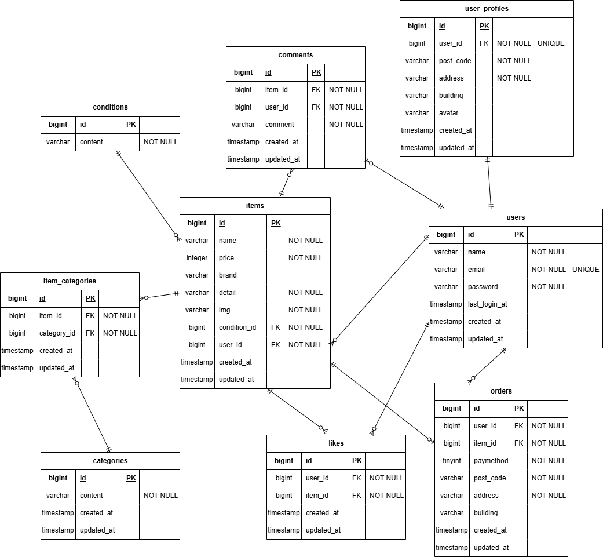

# アプリケーション名
coachtechフリマ

## 環境構築
### Dockerビルド
- git clone git@github.com:Shuta0105/coachtech-freemarket.git
- docker-compose up -d --build

### Laravel環境構築
- docker-compose exec php bash
- composer install
- cp .env.example .env
- php artisan key:generate
- cp .env.example .env.testing
- php artisan key:generate --env=testing
- php artisan config:clear
- php artisan migrate --env=testing
- php artisan migrate --seed

### envファイルの編集
#### .envの変更箇所
- DB_DATABASE=laravel_db
- DB_USERNAME=laravel_user
- DB_PASSOWRD=laravel_pass
- STRIPE_KEY
- STRIPE_SECRET

#### .env.testingの変更箇所
- APP_ENV=test
- DB_HOST=mysql_testing
- DB_DATABASE=demo_test

#### .env.testing変更後
- cp .env.testing .env.dusk.local

#### .env.dusk.local変更箇所 
- APP_URL=http://nginx

## 開発環境
- トップ画面：http://localhost/
- ユーザー登録：http://localhost/register
- phpMyAdmin：http://localhost:8080/

## 使用技術（実行環境）
- PHP 8.1-fpm
- Laravel 8.83.29
- MySQL 8.0.26
- nginx 1.21.1
- stripe 19.1.0

## ER図

